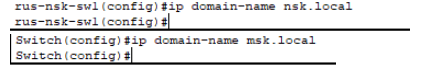
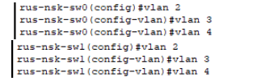

# Отчёт по практической работе  
## «Configure LAN part 1»

**Выполнил:** Иванов Иван  
**Группа:** ПИН-21  
**Репозиторий:** [edu_practice_ivanov](https://github.com/ivanov/edu_practice_ivanov)

---

## Часть 1. Базовая настройка сети (Новосибирск)

### Шаг 1. Построение топологии
Собрана сеть в соответствии со схемой. Использованы устройства: R1, R2, R3, MLS, SW0, SW1, PC0, PC2, PC6, Server-PT.

*Рисунок 1 – Топология сети*

---

### Шаг 2. Настройка MOTD
На каждом устройстве настроено приветственное сообщение с указанием ФИО, группы и номера в журнале.

*Рисунок 2 – Приветственное сообщение на R1*

---

### Шаг 3. Переименование устройств
Устройствам присвоены имена по шаблону:
- rus-nsk-sw0
- rus-nsk-sw1
- rus-msk-r1
- rus-msk-r2
- rus-msk-r3
- rus-msk-mls

*Рисунок 3 – Имя коммутатора SW0*

---

### Шаг 4. Настройка доменных имён
Для Новосибирска задан домен `nsk.local`, для Москвы – `msk.local`.

*Рисунок 4 – Домен на SW0*

---

### Шаг 5. Создание VLAN 2, 3, 4
На SW0 и SW1 созданы VLAN без имён.

*Рисунок 5 – Таблица VLAN на SW0*

---

### Шаг 6. Назначение портов в VLAN
- Fa0/2 → VLAN 2
- Fa0/3 → VLAN 3
- Fa0/4 → VLAN 4

