# Отчёт по практической работе  
## «Configure LAN part 1»

**Выполнил:** Черемисин Кирилл
**Группа:** 324К
**Репозиторий:** [edu_practice_cheremisin](https://github.com/lexstree/edu_practice_cheremisin)

---

## Часть 1. Базовая настройка сети (Новосибирск)

### Шаг 1. Построение топологии
Собрана сеть в соответствии со схемой. Использованы устройства: R1, R2, R3, MLS, SW0, SW1, PC0, PC2, PC6, Server-PT.

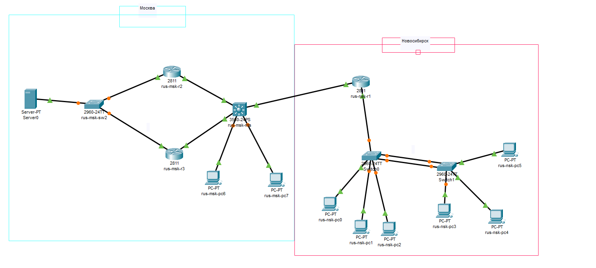
*Рисунок 1 – Топология сети*

---

### Шаг 2. Настройка MOTD
На каждом устройстве настроено приветственное сообщение с указанием ФИО, группы и номера в журнале.

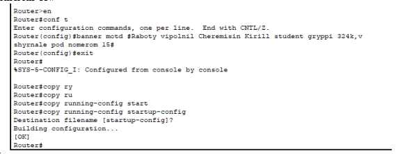

*Рисунок 2 – Приветственное сообщение на R1*

---

### Шаг 3. Переименование устройств
Устройствам присвоены имена по шаблону:
- rus-nsk-sw0
- rus-nsk-sw1
- rus-msk-r1
- rus-msk-r2
- rus-msk-r3
- rus-msk-mls

*Рисунок 3 – Имя коммутатора SW1*

---

### Шаг 4. Настройка доменных имён
Для Новосибирска задан домен `nsk.local`, для Москвы – `msk.local`.

*Рисунок 4 – Домен на SW0*

---

### Шаг 5. Создание VLAN 2, 3, 4
На SW0 и SW1 созданы VLAN без имён.

*Рисунок 5 – Таблица VLAN на SW0*

---

### Шаг 6. Назначение портов в VLAN
- Fa0/2 → VLAN 2
- Fa0/3 → VLAN 3
- Fa0/4 → VLAN 4
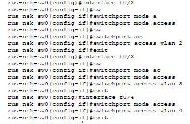

*Рисунок 6 – Порты доступа на SW0*

---

### Шаг 7. Настройка EtherChannel
Между SW0 и SW1 настроен канал EtherChannel (L2) с использованием PAgP. Канал настроен как trunk.

*Рисунок 7 – Состояние EtherChannel*

---

### Шаг 8. Management interface на SW0 (VLAN 1)

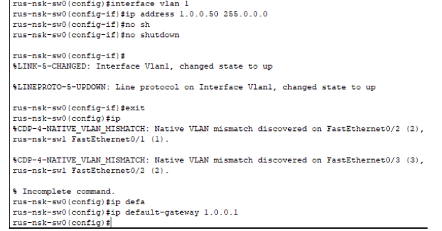

*Рисунок 8 – Интерфейс VLAN 1 на SW0*

---

### Шаг 9. Management interface на SW1 (VLAN 2)

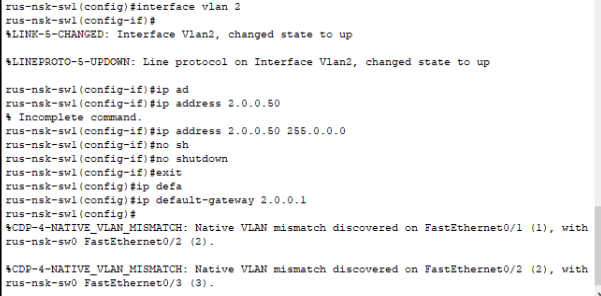

*Рисунок 9 – Интерфейс VLAN 2 на SW1*

---

### Шаг 10. Настройка SSHv2
Сгенерированы RSA-ключи, создан пользователь `nsk` с паролем `cisco`. На линиях VTY разрешён только SSH.

*Рисунок 10 – Параметры SSH на SW1*

---

### Шаг 11. Trunk на Fa0/24 SW0

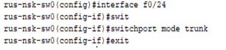

*Рисунок 11 – Параметры trunk на SW0*

---

### Шаг 12. MOTD для SW0 и SW1
При входе отображается имя устройства.

*Рисунок 12 – Сообщение при подключении к SW1*

---

### Шаг 13. Настройка port-security
На портах Fa0/2–4 включены portfast, bpduguard, отключён CDP, настроена port-security с одним MAC-адресом.

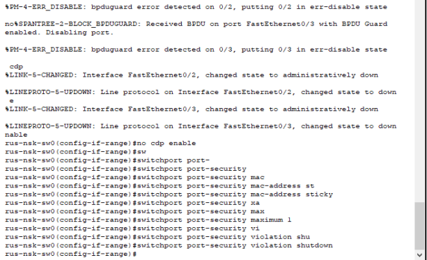

*Рисунок 13 – Конфигурация порта Fa0/3*

---

### Шаг 14. Защита консоли

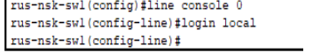

*Рисунок 14 – Настройка line console*

---

### Шаг 15. Отключение таймаута exec

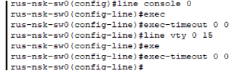

*Рисунок 15 – Отключение таймаута*

---

### Шаг 16. Синхронный вывод логов

*Рисунок 16 – Логирование на консоли*

---

### Шаг 17. Буфер истории

*Рисунок 17 – Размер буфера истории*

---

## Часть 2. Маршрутизация между VLAN на R1

### Шаг 1. IP на Fa0/1

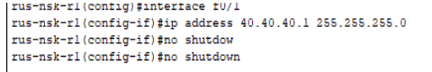

*Рисунок 18 – Интерфейс Fa0/1 R1*

---

### Шаг 2. Сабинтерфейсы для VLAN 1–4

*Рисунок 19 – Сабинтерфейсы на R1*

---

### Шаг 3. DHCP-сервер
Настроены пулы для каждого VLAN.

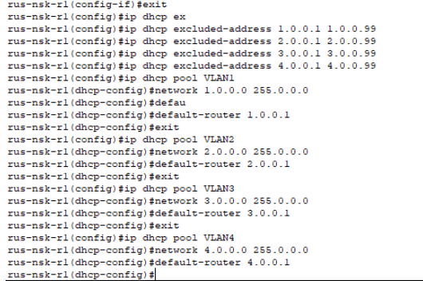

*Рисунок 20 – Пулы DHCP*

---

### Шаг 4. Проверка связи
PC0 (3.0.0.100) пингует 3.0.0.101.

*Рисунок 21 – Результат ping*

---

## Часть 3. Многоуровневый коммутатор MLS

### Шаг 1–2. Имя и маршрутизация

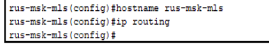

*Рисунок 22 – Включение маршрутизации на MLS*

---

### Шаг 3. VLAN 100 и 200

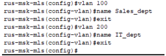

*Рисунок 23 – Таблица VLAN на MLS*

---

### Шаг 4. Назначение портов

*Рисунок 24 – Порты доступа на MLS*

---

### Шаг 5. SVI для VLAN 100 и 200

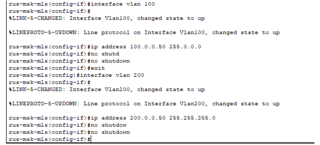

*Рисунок 25 – Интерфейсы VLAN на MLS*

---

### Шаг 6. Интерфейсы L3

*Рисунок 26 – IP на интерфейсах MLS*

---

### Шаг 7. Проверка
PC6 пингует 200.0.0.50.

*Рисунок 27 – Результат ping*

---

## Часть 4. HSRP в Москве

### Шаг 1–2. IP на R2 и R3

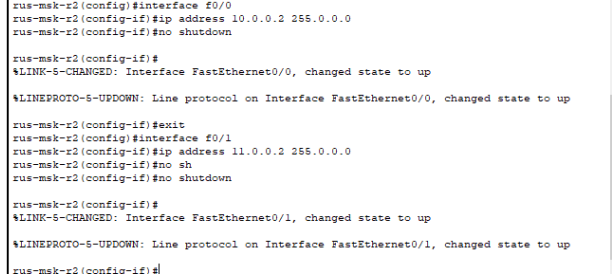

*Рисунок 28 – Интерфейсы R2*

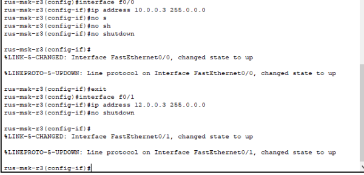

*Рисунок 29 – Интерфейсы R3*

---

### Шаг 3. HSRP
Настроена группа 1 с виртуальным IP 10.0.0.1. R2 – активный, R3 – резервный. Включено вытеснение.

*Рисунок 30 – HSRP на R2*

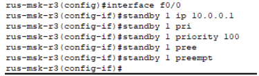

*Рисунок 31 – HSRP на R3*

---

## Часть 5. Динамическая маршрутизация EIGRP

### Шаг 1. Настройка EIGRP AS 100
На всех маршрутизаторах и MLS настроен EIGRP.

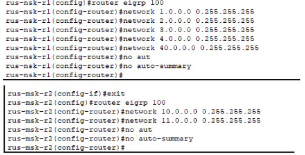

*Рисунок 32 – Конфигурация EIGRP на R1*

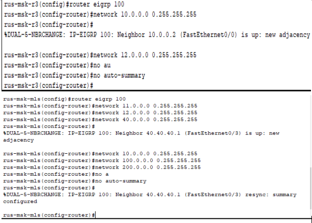

*Рисунок 33 – Маршруты EIGRP на R2 и MLS*

---

### Шаг 2. SSH с сервера
С сервера 10.0.0.100 выполнено подключение к SW1 (2.0.0.50).

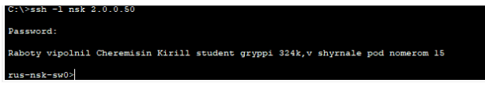

*Рисунок 34 – Подключение по SSH*

---

### Шаг 3. Ping с сервера до 2.0.0.50

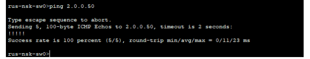

*Рисунок 35 – Результат ping*

---

## Часть 6. Безопасность и фильтрация

### Шаг 1–2. Доступ к веб-серверу
Настроен ACL, разрешающий доступ к серверу 10.0.0.100 только для PC с IP 2.0.0.100.

*Рисунок 36 – ACL для VLAN 2*

---

### Шаг 3. Запрет ответов на ping
На R2 и R3 настроен ACL, блокирующий входящие ICMP-запросы.

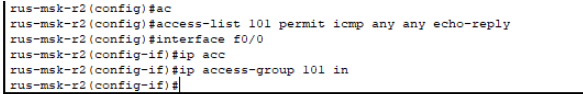

*Рисунок 37 – ACL на R2*

---

## Часть 7. Туннели и RIPv2

### Шаг 1–2. Loopback интерфейсы

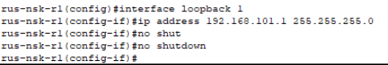

*Рисунок 38 – Loopback 1 на R1*

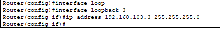

*Рисунок 39 – Loopback 3 на R3*

---

### Шаг 3–4. RIPv2
На R1 и R3 настроен RIPv2.

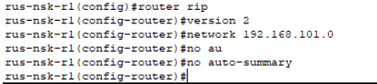

*Рисунок 40 – RIPv2 на R1*

---

### Шаг 5. Туннели GRE
Настроены туннели между R1 и R3.

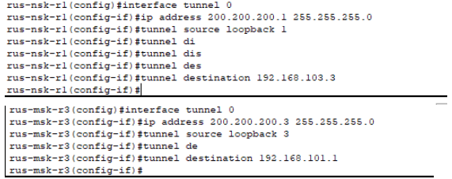

*Рисунок 41 – Туннель на R1*

---

### Шаг 6. Расширенный ping
Выполнен ping с R1 до 192.168.103.3 с источника 192.168.101.1.

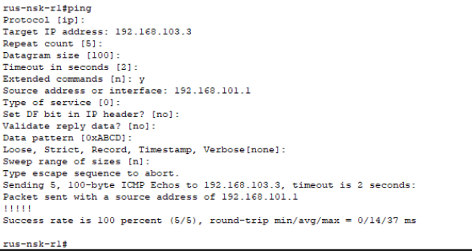

*Рисунок 42 – Результат ping*

---

## Часть 8. Сервисы и управление

### Шаг 1. NTP и Syslog
На всех устройствах настроен NTP и логирование на сервер 10.0.0.100.

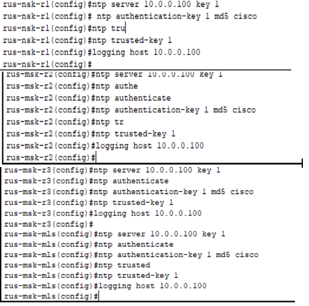

*Рисунок 43 – NTP на R1,R2,R3,MLS*

---

### Шаг 2. SNMP
На R2 и R3 включён SNMP с паролем `cisco`.

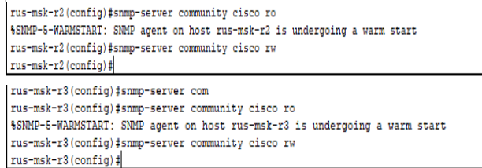

*Рисунок 44 – SNMP на R2 и R3*

---

### Шаг 3. Telnet с AAA
На R3 настроен Telnet с использованием AAA-сервера и локальной базы как резерва.

*Рисунок 45 – AAA на R3*

---

### Шаг 4–6. FTP-TFTP-копирование с R2 и R3
Настроен FTP-клиент, выполнено копирование конфигурации.

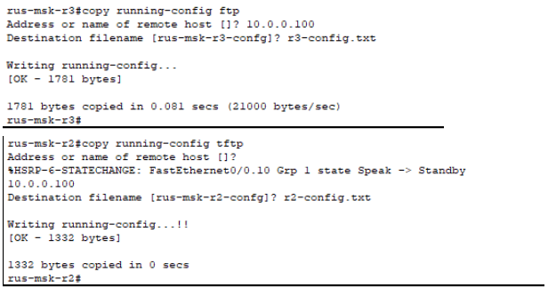

*Рисунок 46 – Копирование по FTP и TFTP*

---

### Шаг 7. Проверка `boot system`
В конфигурации R3 отсутствуют команды `boot system`.

*Рисунок 48 – Проверка загрузки R3*

---

### Шаг 8. Ping и telnet по имени `standby`
На R2 настроена статическая запись для имени `standby` (10.0.0.3).

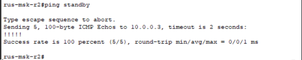

*Рисунок 49 – Ping по имени standby*

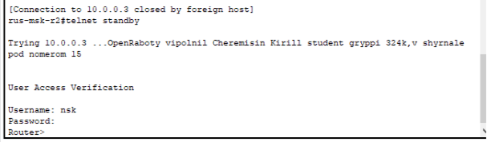

*Рисунок 50 – Telnet к R3 по имени*

---

### Шаг 9. Восстановление пароля на R3
Выполнена процедура восстановления пароля через ROMmon. Пароль пользователя изменён.

*Рисунок 51 – Вход в ROMmon*

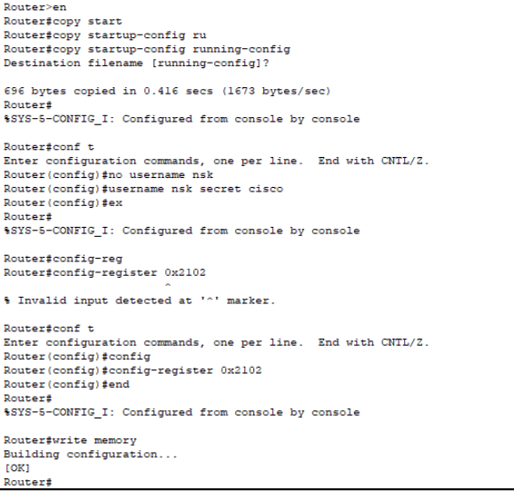

*Рисунок 52 – Смена пароля на R3*

---

## Заключение
В ходе выполнения работы была полностью настроена сеть в соответствии с заданием. Реализованы:
- VLAN, Trunk, EtherChannel
- Маршрутизация между VLAN (Router-on-a-Stick)
- HSRP, EIGRP, RIPv2
- Туннели GRE
- SSH, NTP, Syslog, SNMP, FTP, TFTP
- Элементы безопасности (Port-Security, ACL, защита паролей)

Все проверки выполнены успешно. Цель работы достигнута.

---

